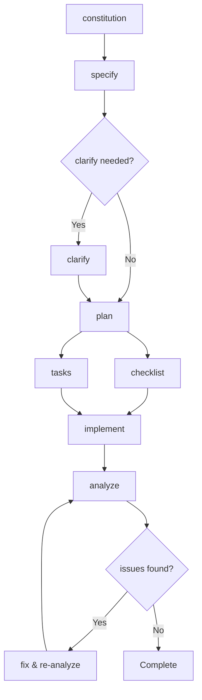

# GitHub Spec Kit → Cline Workflows

Complete conversion of GitHub's Spec Kit steering documents into Cline Workflows for systematic feature development.

## Overview

This directory contains 8 comprehensive workflows that implement GitHub's Spec Kit methodology within Cline's workflow system. These workflows provide a systematic approach to feature specification, planning, implementation, and quality validation.

## Workflow Structure

### Foundation Workflows (Start Here)
1. **[constitution.cline](./constitution.cline)** - Project governance and principles
2. **[specify.cline](./specify.cline)** - Feature specification creation from natural language
3. **[clarify.cline](./clarify.cline)** - Specification clarification and ambiguity resolution

### Planning Workflows
4. **[plan.cline](./plan.cline)** - Implementation planning and technical design  
5. **[checklist.cline](./checklist.cline)** - Quality validation checklists generation

### Execution Workflows
6. **[tasks.cline](./tasks.cline)** - Task breakdown and implementation planning
7. **[implement.cline](./implement.cline)** - Systematic implementation execution
8. **[analyze.cline](./analyze.cline)** - Cross-artifact consistency analysis

## Workflow Dependencies



## Quick Start Guide

### 1. Initialize Project Governance
```bash
# Run constitution workflow to establish project principles
# This creates .clinerules/memory/constitution.md
```

### 2. Create Feature Specification
```bash
# Run specify workflow with your feature description
# Creates: specs/[N]-[feature-name]/spec.md
# Creates: feature branch [N]-[feature-name]
```

### 3. Clarify Requirements (if needed)
```bash
# Run clarify workflow to resolve ambiguities
# Updates: specs/[N]-[feature-name]/spec.md with clarifications
```

### 4. Generate Implementation Plan
```bash  
# Run plan workflow to create technical architecture
# Creates: specs/[N]-[feature-name]/plan.md
# Creates: specs/[N]-[feature-name]/data-model.md
# Creates: specs/[N]-[feature-name]/contracts/
```

### 5. Create Quality Checklists
```bash
# Run checklist workflow for domain-specific validation
# Creates: specs/[N]-[feature-name]/checklists/[domain].md
```

### 6. Break Down Into Tasks
```bash
# Run tasks workflow to create implementation tasks
# Creates: specs/[N]-[feature-name]/tasks.md
```

### 7. Execute Implementation
```bash
# Run implement workflow for systematic execution
# Executes all tasks with quality gates and progress tracking
```

### 8. Validate Consistency
```bash
# Run analyze workflow for final validation
# Generates cross-artifact analysis report
```

## Detailed Workflow Guide

### Constitution Workflow
**Purpose:** Establish project governance and principles
**When to Run:** Once per project, or when updating governance
**Outputs:** `.clinerules/memory/constitution.md`

**Key Features:**
- Interactive principle collection
- Semantic versioning for governance changes
- Cross-workflow consistency propagation
- Template synchronization

### Specify Workflow  
**Purpose:** Create comprehensive feature specifications
**When to Run:** For each new feature or major enhancement
**Inputs:** Natural language feature description
**Outputs:** Complete specification with validation

**Key Features:**
- Automatic branch name generation
- Built-in quality validation
- Clarification question generation
- Git integration with proper branching

### Clarify Workflow
**Purpose:** Resolve specification ambiguities systematically  
**When to Run:** When specifications contain unclear requirements
**Outputs:** Updated specification with resolved ambiguities

**Key Features:**
- Structured ambiguity detection
- Interactive clarification process
- Incremental specification updates
- Coverage analysis across requirement categories

### Plan Workflow
**Purpose:** Create technical implementation plans
**When to Run:** After specification is complete and clarified
**Outputs:** Technical architecture, data models, API contracts

**Key Features:**
- Technology stack decision support
- Constitutional compliance validation
- Data model generation from requirements
- API contract creation
- Development environment setup guides

### Checklist Workflow
**Purpose:** Generate quality validation checklists
**When to Run:** Throughout development for quality gates
**Outputs:** Domain-specific requirement quality checklists

**Key Features:**
- "Unit tests for requirements writing"
- Domain-specific checklist generation (UX, API, Security, etc.)
- Traceability to specification sections
- Quality dimension analysis (completeness, clarity, consistency)

### Tasks Workflow
**Purpose:** Break implementation plans into actionable tasks
**When to Run:** After implementation plan is complete
**Outputs:** Detailed task breakdown with dependencies

**Key Features:**
- Phase-based task organization
- Dependency management and parallel execution planning
- Acceptance criteria for each task
- Critical path analysis

### Implement Workflow
**Purpose:** Execute implementation tasks systematically
**When to Run:** After task breakdown is complete
**Outputs:** Fully implemented feature with quality validation

**Key Features:**
- Phase-by-phase execution with quality gates
- Constitutional compliance monitoring
- Progress tracking and reporting
- Automatic ignore file management
- Error handling and recovery

### Analyze Workflow
**Purpose:** Validate cross-artifact consistency and quality
**When to Run:** After task completion or before major milestones
**Outputs:** Comprehensive analysis report with remediation guidance

**Key Features:**
- Cross-artifact consistency validation
- Constitutional compliance verification
- Coverage gap analysis
- Structured findings with severity classification
- Actionable remediation recommendations

## File Structure Created

```
specs/
└── [N]-[feature-name]/
    ├── spec.md                 # Feature specification
    ├── plan.md                 # Implementation plan
    ├── tasks.md                # Task breakdown
    ├── data-model.md           # Data model design
    ├── research.md             # Technical research
    ├── quickstart.md           # Development setup
    ├── checklists/             # Quality validation
    │   ├── ux.md
    │   ├── api.md
    │   └── security.md
    └── contracts/              # API specifications
        ├── openapi.yaml
        └── graphql.schema

.clinerules/
├── memory/
│   └── constitution.md         # Project governance
├── templates/                  # Workflow templates
└── workflows/                  # This directory
```

## Quality Gates and Validation

### Built-in Quality Gates
- **Constitutional Compliance:** Every workflow validates against project governance
- **Specification Quality:** Automated validation of requirement completeness and clarity
- **Cross-Artifact Consistency:** Analysis workflow ensures alignment between documents
- **Task Coverage:** Verification that all requirements have implementation tasks
- **Progress Validation:** Each implementation phase includes validation checkpoints

### Quality Assurance Features
- **Traceability:** Requirements traced through to implementation tasks
- **Version Control:** Proper Git integration with meaningful commit messages
- **Documentation:** Comprehensive documentation generated throughout process
- **Testing Integration:** Quality workflows include testing strategy and validation
- **Error Recovery:** Graceful error handling with remediation guidance

## Advanced Usage

### Parallel Development
- Multiple features can use workflows simultaneously
- Branch-based isolation prevents conflicts
- Constitutional consistency maintained across features

### Continuous Integration
- Workflows designed for CI/CD integration
- Quality gates can be automated in build pipelines
- Analysis reports suitable for automated quality checks

### Team Collaboration
- Workflows support review processes
- Clear handoff points between team members
- Standardized documentation format for consistency

### Customization
- Workflows can be adapted for specific project needs
- Constitutional principles provide customization framework
- Template system allows organization-specific modifications

## Best Practices

### Getting Started
1. **Always start with constitution workflow** - Establish governance first
2. **Use specify workflow for all features** - Maintain consistency
3. **Don't skip clarify workflow** - Ambiguity costs more later
4. **Generate multiple checklists** - Different domains need different validation

### Quality Maintenance  
1. **Run analyze workflow regularly** - Catch inconsistencies early
2. **Update constitution as needed** - Governance should evolve
3. **Maintain checklist discipline** - Quality gates prevent technical debt
4. **Document lessons learned** - Improve workflows over time

### Team Adoption
1. **Train team on workflow sequence** - Dependencies matter
2. **Establish review checkpoints** - Quality gates need team buy-in  
3. **Customize for your context** - Adapt workflows to team needs
4. **Iterate and improve** - Workflows should evolve with experience

## Troubleshooting

### Common Issues
- **Missing prerequisites:** Each workflow validates dependencies and provides clear error messages
- **Constitutional violations:** Analysis workflow flags compliance issues with remediation guidance  
- **Incomplete specifications:** Quality validation prevents progression until issues resolved
- **Task dependency conflicts:** Dependency analysis identifies and resolves circular dependencies

### Getting Help
- Each workflow contains comprehensive documentation
- Error messages include specific remediation guidance
- Cross-references between workflows provide context
- Quality guidelines ensure consistent application

## Migration from GitHub Spec Kit

If you're migrating from the original GitHub Spec Kit:

### Key Differences
- **Platform Integration:** Native Cline workflow integration vs external scripts
- **Cross-Platform:** Windows/Mac/Linux compatibility vs bash/PowerShell scripts  
- **Quality Gates:** Enhanced validation and constitutional compliance
- **Documentation:** Comprehensive inline documentation and examples

### Migration Benefits
- **Reduced Setup:** No external script dependencies
- **Enhanced Quality:** More sophisticated validation and analysis
- **Better Integration:** Native Cline tool usage throughout
- **Improved Usability:** Interactive clarification and guidance

## Contributing

To improve these workflows:
1. Follow the constitutional principles established in your project
2. Maintain backward compatibility where possible
3. Update cross-references when adding new features
4. Test workflow sequences to ensure proper dependency handling
5. Update documentation to reflect changes

## License

These workflows are converted from GitHub's Spec Kit under the same open source principles. Adapt and modify as needed for your organization's requirements.
